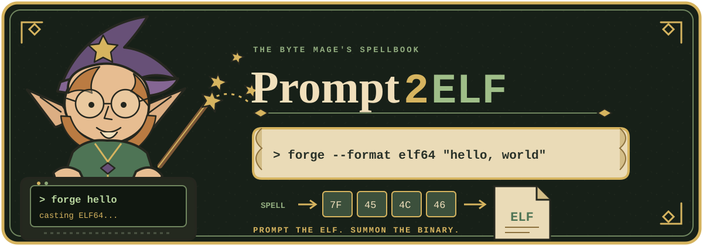

<p align="center">
  
</p>

# Prompt2ELF

Prompt2ELF is a reusable Agent Skill for direct, zero-toolchain generation of Linux x86-64 ELF executables.

Instead of generating C, Rust, assembly, a build configuration, or a framework project, the coding agent reasons directly about the executable format, instruction encoding, operating system ABI, syscall interface, memory layout, and data representation. Its output is the final sequence of bytes that the target machine executes.

The bundled Linux x86-64 reference suite includes four programs:

- A 167-byte Hello World executable
- A 334-byte hexadecimal binary writer
- A 322-byte ASCII Mandelbrot renderer
- A 449-byte HTTP server listening on `0.0.0.0:9000`

No compiler, assembler, linker, package manager, standard library, language runtime, or application framework is required to reproduce these executables from the included hexadecimal sources.

## Why Prompt2ELF?

The name describes the interface directly:

```text
prompt -> reasoning -> ELF bytes -> execution
```

An AI model becomes the software construction interface. ELF is the first supported target format, and the same method can extend to PE, Mach-O, firmware images, boot sectors, and other architecture-specific binary formats.

## What zero-toolchain means

Prompt2ELF removes the conventional software toolchain from the generation path:

```text
Traditional:
intent -> source code -> compiler -> assembler -> linker -> runtime -> executable

Prompt2ELF:
intent -> model -> final executable bytes
```

This does not mean that computation has literally zero dependencies. The current binaries still require:

- An x86-64 processor
- A Linux kernel
- The Linux x86-64 syscall ABI
- The ELF loader built into the kernel
- A filesystem and an execution mechanism
- An initial channel capable of placing bytes on disk

The meaningful claim is narrower and testable: the generated programs have no compiler, assembler, linker, libc, language runtime, package, or framework dependency.

## Agent Skill

The root `SKILL.md` follows the open Agent Skills specification. It contains portable activation metadata, generation constraints, a byte-encoding workflow, validation requirements, and safety rules for coding agents.

The repository can be installed as a skill for:

| Agent | Project location | Personal location |
| --- | --- | --- |
| Claude Code | `.claude/skills/prompt2elf/` | `~/.claude/skills/prompt2elf/` |
| Devin | `.devin/skills/prompt2elf/` | `~/.config/devin/skills/prompt2elf/` |
| GitHub Copilot | `.github/skills/prompt2elf/` | `~/.copilot/skills/prompt2elf/` |
| OpenCode | `.agents/skills/prompt2elf/` | `~/.agents/skills/prompt2elf/` |

Clone or copy the complete repository into the location for the selected agent. The repository directory must remain named `prompt2elf` so it matches the skill name.

Example personal installation for Claude Code:

```bash
mkdir -p ~/.claude/skills
git clone https://github.com/faustinoaq/prompt2elf.git ~/.claude/skills/prompt2elf
```

Invoke it explicitly with `/prompt2elf` where slash skills are supported, or ask the agent to create, explain, modify, or verify a raw Linux x86-64 ELF binary.

Example requests:

```text
Use Prompt2ELF to create a raw executable that prints the current process ID.
Use Prompt2ELF to add a loopback-only HTTP status server.
Use Prompt2ELF to explain every instruction in hex/hello.hex.
Use Prompt2ELF to verify that all hexadecimal sources reproduce their binaries.
```

A project-local Devin adapter is included at `.devin/skills/prompt2elf/SKILL.md`. It loads the canonical portable skill from the repository root.

## Repository layout

```text
prompt2elf/
├── SKILL.md
├── README.md
├── .devin/
│   └── skills/
│       └── prompt2elf/
│           └── SKILL.md
├── bin/
│   ├── hello.bin
│   ├── hello-from-writer.bin
│   ├── hexwriter.bin
│   ├── mandelbrot.bin
│   └── server.bin
└── hex/
    ├── README.md
    ├── hello.hex
    ├── hexwriter.hex
    ├── mandelbrot.hex
    └── server.hex
```

The files in `hex/` are plain hexadecimal representations of the executable bytes. They contain no assembly language and require no assembler. See `hex/README.md` for the byte layout, instruction groups, syscall use, build command, and verification procedure for every example.

## Quick start

These programs run only on Linux x86-64.

### Hello World

```bash
./bin/hello.bin
```

Output:

```text
Hello, world!
```

### Mandelbrot renderer

```bash
./bin/mandelbrot.bin
```

This computes a 64 by 32 ASCII Mandelbrot set at runtime using fixed-point integer arithmetic.

### HTTP server

```bash
./bin/server.bin &
SERVER_PID=$!
```

Open `http://127.0.0.1:9000/` in a browser. The response is:

```http
HTTP/1.0 200 OK
Content-Type: text/plain
Content-Length: 14

Hello, world!
```

Stop the server with:

```bash
kill "$SERVER_PID"
```

The server binds to `0.0.0.0`, so it listens on every available network interface.

## Rebuilding binaries without a compiler

`hexwriter.bin` reads hexadecimal text from standard input and writes the decoded bytes to a named output file. It also marks the output executable through the Linux `fchmod` syscall.

Rebuild Hello World:

```bash
./bin/hexwriter.bin /tmp/hello.bin < hex/hello.hex
/tmp/hello.bin
```

Rebuild every example:

```bash
mkdir -p rebuilt
./bin/hexwriter.bin rebuilt/hello.bin < hex/hello.hex
./bin/hexwriter.bin rebuilt/hexwriter.bin < hex/hexwriter.hex
./bin/hexwriter.bin rebuilt/mandelbrot.bin < hex/mandelbrot.hex
./bin/hexwriter.bin rebuilt/server.bin < hex/server.hex
```

The writer expects plain hexadecimal digits and whitespace. Do not use `0x` prefixes or comments. It creates or truncates the output path, so choose that path carefully.

The writer can recreate itself:

```bash
./bin/hexwriter.bin /tmp/hexwriter-copy.bin < hex/hexwriter.hex
```

At that point the process is self-hosting at the byte-materialization layer. An existing raw executable transforms the AI-produced hexadecimal representation into another raw executable.

## The bootstrap boundary

A binary writer cannot create itself before any executable bytes exist. The first writer needs a bootstrap path.

For the initial bootstrap, `hexwriter.bin` was emitted with the shell's built-in `printf`, using byte escapes such as `\x7f`, followed by one `chmod` operation. After that initial seed, the writer can reproduce itself and create all other binaries.

If an AI interface can write arbitrary byte arrays directly, even this bootstrap command is unnecessary. The model can return a binary payload rather than textual hexadecimal. The operating system still needs to store it with executable permissions and invoke it.

This distinction matters. Prompt2ELF does not make the machine disappear. It removes the conventional source-to-binary translation stack.

## What a raw ELF executable contains

Linux does not execute an arbitrary file merely because it contains CPU instructions. The kernel first needs a description of how those bytes should be mapped into memory.

The minimal executables in this repository contain:

1. A 64-byte ELF header
2. A 56-byte program header
3. x86-64 machine instructions
4. Any inline data needed by the program

The ELF header identifies the file as:

- A 64-bit ELF executable
- Little-endian
- Targeting x86-64
- Using a fixed entry address
- Containing one program header

The program header tells Linux to map the file into memory as one readable and executable segment. There is no dynamic loader and no section table.

Sections such as `.text`, `.data`, `.symtab`, and `.debug_info` are useful to compilers, linkers, debuggers, and analysis tools. They are not required for these programs. The kernel needs the loadable segment and entry point, not linker-oriented organization.

After loading the segment, Linux jumps directly to the encoded entry address. From that point onward, the processor decodes the instruction bytes.

## Direct Linux syscalls

The programs do not call libc. They communicate with Linux through the x86-64 syscall instruction.

For the Linux x86-64 syscall ABI:

```text
rax = syscall number
rdi = argument 1
rsi = argument 2
rdx = argument 3
r10 = argument 4
r8  = argument 5
r9  = argument 6
```

The `syscall` instruction transfers control to the kernel.

### Hello World

`hello.bin` places the `write` syscall number in `rax`, standard output in `rdi`, the message address in `rsi`, and the message length in `rdx`. It then invokes `exit` with status zero.

Its complete layout is:

| Part | Bytes |
| --- | ---: |
| ELF header | 64 |
| Program header | 56 |
| Machine code | 33 |
| Message | 14 |
| Total | 167 |

### Hex writer

`hexwriter.bin` uses these syscalls:

- `open`
- `read`
- `write`
- `fchmod`
- `close`
- `exit`

It converts each pair of textual hexadecimal digits into one byte. For example:

```text
'4' -> 0100
'8' -> 1000

01001000 -> 0x48 -> 'H'
```

### Mandelbrot renderer

`mandelbrot.bin` computes the set rather than printing embedded artwork. It uses Q10 fixed-point arithmetic, where `1024` represents `1.0`.

For each terminal position it iterates:

```text
new_zx = zx * zx - zy * zy + cx
new_zy = 2 * zx * zy + cy
```

The multiplications are rescaled with signed bit shifts. Escape depth selects a character from this palette:

```text
 .:-=+*#@
```

Each 64-character row plus newline is written with one syscall.

### HTTP server

`server.bin` uses:

- `socket`
- `setsockopt`
- `bind`
- `listen`
- `accept`
- `read`
- `sendto`
- `close`
- `exit`

It enables `SO_REUSEADDR`, binds an IPv4 socket to port 9000 on all interfaces, accepts one connection at a time, reads the request, returns a fixed HTTP response, closes the client socket, and accepts the next connection.

A browser, HTTP library, or `curl` command is only a client used to reach the server. The server itself has no dependency on them.

## How far can this go?

Machine code is a complete programming language. Once the instruction set and operating system ABI are available, raw bytes can express the same computations as code produced by a conventional compiler.

In principle, an AI-to-binary interface can generate:

- File and directory utilities
- Text processing tools
- Network clients and servers
- Compression and archive tools
- Process supervisors
- Diagnostics and recovery utilities
- Graphical programs that speak a display protocol
- Bootloaders and kernels for a defined hardware target
- A compiler, assembler, linker, or interpreter
- A multicall executable similar in spirit to BusyBox

A future Prompt2ELF multicall binary could inspect its first argument and expose applets such as:

```text
promptelf echo
promptelf cat
promptelf ls
promptelf stat
promptelf mkdir
promptelf cp
promptelf serve
promptelf inspect
```

That binary could provide a compact user environment made entirely from directly synthesized instructions and syscall interactions. There is no theoretical requirement for a higher-level language in the middle. The main constraints are engineering complexity, correctness, maintainability, portability, and security.

## AI-to-binary interface

A practical interface needs a precise target profile:

```text
Target architecture: x86-64
Endianness: little-endian
Operating system: Linux
Executable format: ELF64
ABI: Linux syscall ABI
Load strategy: fixed ET_EXEC image
Allowed CPU features: baseline x86-64
```

The generation flow can then be:

```text
1. Receive a program specification
2. Design memory layout and control flow
3. Select syscalls and calling conventions
4. Encode each instruction
5. Resolve branch and data offsets
6. Construct executable headers
7. Emit final bytes
8. Validate file size, entry point, and behavior
9. Execute in an isolated environment
```

The model is functioning as planner, code generator, instruction encoder, linker, and binary-format writer. These logical jobs still exist, but they occur inside the model's reasoning rather than in separate external tools.

## Why this is interesting

Modern software stacks often contain millions of lines of transitive dependencies before a program prints one line or accepts one socket. Prompt2ELF takes the opposite approach.

The examples demonstrate that:

- A useful executable can be smaller than many source-file headers
- The kernel ABI can serve as the complete runtime boundary
- Executable formats are understandable data structures
- Instruction encoding can be generated deliberately
- A tiny native writer can bootstrap additional programs
- AI can bridge human intent and architecture-specific bytes directly

Prompt2ELF does not replace compilers by default. Compilers provide optimization, portability, diagnostics, reproducibility, debug information, tested transformations, and decades of correctness work. Prompt2ELF provides a direct interface for cases where a model can reason accurately at every layer and final executable bytes are the required artifact.

## Current limitations

- Every executable is Linux x86-64 specific
- Branch offsets and header sizes are manually resolved
- Error handling is intentionally minimal
- The server handles clients sequentially
- The binaries have no symbols or debug information
- There is no automatic relocation or address-space randomization
- Larger programs become difficult to audit as plain hexadecimal text
- Generated native code must be treated as untrusted until verified

For serious use, generated binaries should run first inside a VM, container, sandbox, or similarly restricted environment. Reproducible byte output, integrity hashes, syscall restrictions, test vectors, and machine-readable manifests would make the interface safer and easier to audit.

## Project direction

A useful next milestone is a single raw multicall executable with a small collection of file, text, process, and network utilities. That would test whether an AI-generated binary can grow from isolated demonstrations into a coherent, BusyBox-style environment while retaining:

- No external build toolchain
- No runtime library
- Direct syscall control
- Reproducible byte output
- A clearly defined architecture profile
- Small, inspectable artifacts

Prompt2ELF demonstrates that source code is not the only possible interface between an idea and a machine. With a precise target and enough architectural knowledge, the interface can be the executable itself.
